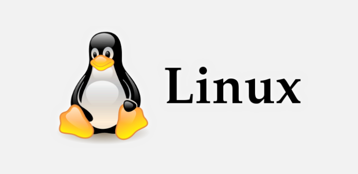

**Linux**

**O que é Linux?**

Para muita gente, o Linux é meramente um sistema operacional. Essa definição não está errada, mas também não está completa. Na verdade, o Linux é parte de um todo, mais precisamente, é um kernel de código-fonte* aberto, que foi — e é desenvolvido — ao longo do tempo graças à colaboração voluntária de desenvolvedores de várias partes do mundo. O Linux tem muitas outras características positivas. Uma das mais bem vistas e utilizadas no campo da tecnologia é o fato de estarmos lidando com um Software livre (Open Source).

**A história do Linux**

A história do Linux começa no ano de 1991, pelas mãos de um estudante universitário finlandês chamado Linus Torvalds. O Linux foi criado por ele, não totalmente do "zero", mas sim como uma variação do Minix. O Minix é um sistema operacional simples, criado por Andrew S. Tanenbaum, um renomado professor de computação que é conhecido pelos diversos livros que escreveu para a área.Tanenbaum disponibilizou o Minix principalmente para servir de auxílio no ensino de computação. Trata-se de um sistema operacional simples, que exige poucos recursos de hardware e cuja primeira versão foi lançada em 1987.

**O que é kernel?**

Kernel pode ser entendido como o núcleo do sistema operacional, isto é, como a parte essencial deste. Cabe ao kernel fazer a intermediação entre o hardware e os programas executados pelo computador. Isso significa que a junção do kernel mais os softwares que tornam o computador usável (drivers, protocolos de comunicação, entre outros), de acordo com a sua aplicação, é que formam o sistema operacional em si.

Para compreender melhor, você pode imaginar o kernel como sendo o chassi de um veículo. De acordo com a aplicação em questão, uma montadora pode adquirir um chassi e utilizá-lo para montar um carro para transportar cargas ou, se a necessidade for esta, construir um automóvel de passeio para uma família.

**O Linux na programação: Desenvolvedores**

Saber Linux é muito importante para desenvolvedores. Apesar de muitas vezes não ser o foco do trabalho desse profissional, esse conhecimento facilita e muito a vida do Dev.

E, a grande maioria das linguagens, são beneficiadas quando utilizadas e conjunto com distros Linux, devido aos diversos motivos já citados anteriormente.

A grosso modo, se essa linguagem não é da Microsoft, ela terá uma performance melhor quando utilizada junto com o Linux. Portanto, se você não usa C# ou Visual Basic, você irá acabar optando por um ambiente Linux, por questões de performance.