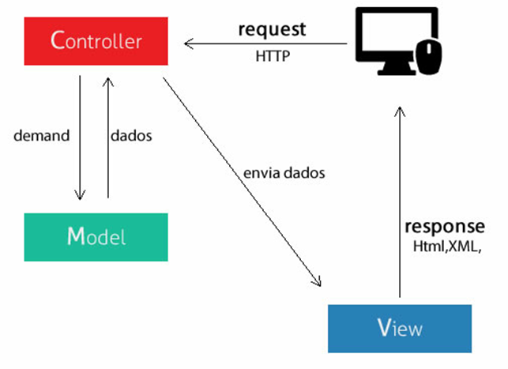
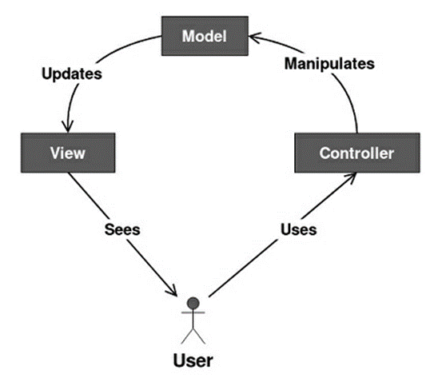
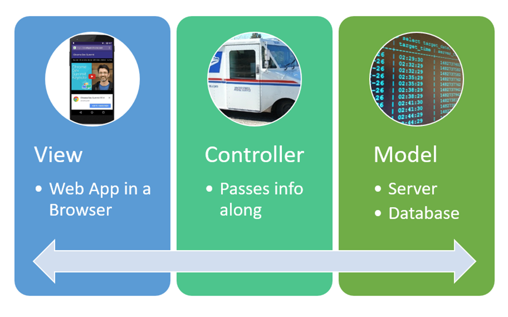
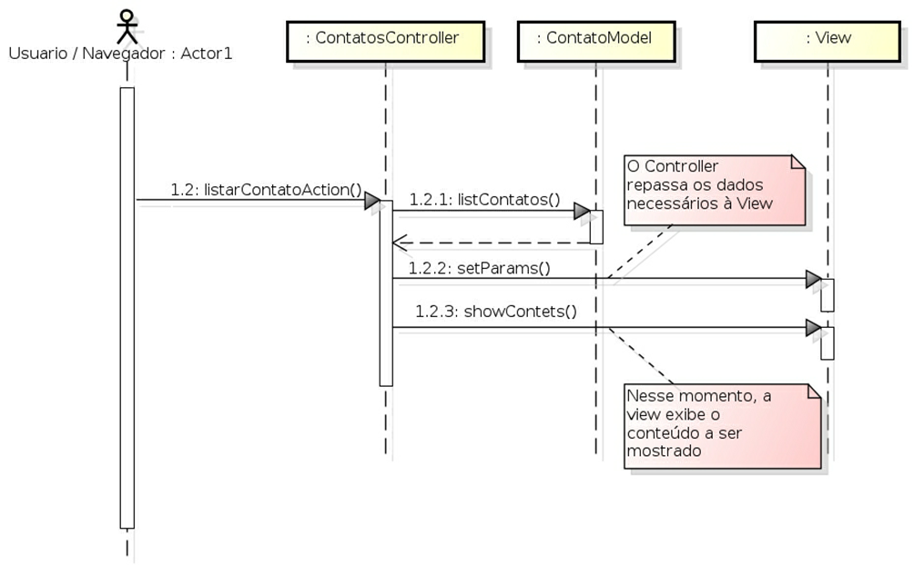

# Introdução

Tudo começou quando o engenheiro civil Christopher Alexander criou o que se considera o primeiro padrão de projeto na década de 70. A partir disso, o norueguês Trygve Mikkjel Heyerdahl Reenskaug, funcionário da Xerox PARC, deu início em 1979, a criação do que viria ser o padrão MVC, com o objetivo de construir interfaces gráficas em Smalltalk, sendo descrita sua implementação original no artigo "Applications Programming in Smalltalk-80: How to use Model-View-Controller".

O MVC (Model-View-Controller) é um dos padrões de arquitetura de software mais conhecidos e utilizados. Tem a função de facilitar a troca de informações entre a interface do usuário aos dados no banco, aumentando a agilidade das respostas. Apesar de ter sido desenvolvido inicialmente para computação pessoal, atualmente é base do gerenciamento de interação em muitas aplicações/sistemas web e aplicativos mobile.

# O Que Faz?
A arquitetura MVC promove a divisão das responsabilidades em três camadas/componentes independentes muito bem definidos(as): o componente de interação do usuário (view), o componente de manipulação dos dados (model) e o componente de controle (controller). Divide a funcionalidade de uma aplicação. Com o MVC, é possível dividir o problema em vários problemas menores. Além de facilitar a manutenção do código e sua reutilização, podendo ser feitas alterações sem que os lados interfiram entre si.

> "Com o advento da internet houve um movimento para separar a lógica de negócio da interface com o usuário. A ideia é que os usuários da WEB possam acessar as mesmas aplicações sem ter que instalar estas aplicações em suas máquinas locais. Neste modelo o aplicativo é movido para o Servidor e um navegador Web (browser) é usado como um cliente. O aplicativo é executado em servidores Web com os quais o navegador Web se comunica e gera o código HTML para ser exibido no cliente. Neste modelo a lógica de apresentação está separada em sua própria camada lógica e física". (Josué Luciano e Wallison Joel Barberá Alves, 2011)”.

Figura 01 - As camadas do Modelo MVC

fonte: portal gsti (2017)

 

Figura 02 - Arquitetura básica do Model View Controller

fonte: ptutorialspoint

>"A separação em camadas lógicas torna os sistemas mais flexíveis permitindo que as partes possam ser alteradas de forma independente. As funcionalidades da camada de negócio podem ser divididas em classes e essas classes podem ser agrupadas em pacotes ou componentes reduzindo as dependências entre as classes e pacotes; podem ser reutilizadas por diferentes partes do aplicativo e até por aplicativos diferentes. O modelo de 3 camadas tornou-se a arquitetura padrão para sistemas corporativos com base na Web". (Josué Luciano e Wallison Joel Barberá Alves, 2011)”.

# Composição
- Modelo (model): representa as informações com as quais a aplicação irá operar, e fornece ao controlador o acesso aos dados. Objeto de aplicação.
- Visualização (view): responsável por interpretar o modelo e representá-lo para possibilitar a interação. Apresentação na tela.
- Controlador (controller): geralmente responde às ações do usuário, essas ações são feitas a partir da camada de apresentação. Liga o modelo e a visualização. Também serve como uma espécie de filtro, aumentando a segurança

Figura 03 - Web app MVC

fonte: educative (2020)

 

Figura 04 - Diagrama de Sequência MVC

fonte: educative (2020)

# MVC Vantagens
- Suporte para diferentes tipos de dispositivos;
- Reduz a complexidade de aplicações;
- Torna o sistema escalável;
- Reuso do código;
- Promove o aumento de coesão nas classes do projeto;
- Implementação de segurança;
- Melhor visibilidade da camada de negócios;
- Aumento de produtividade, agilidade;
- Facilita a testabilidade;
- Facilidade em entender a estrutura do código, realizar manutenção e encontrar erros;
- Além de facilitar a colaboração dos desenvolvedores.

# MVC Desvantagens
- Maior tempo para analisar e modelar o sistema;
- É preciso mão-de-obra especializada;
- Muitos códigos são mantidos no controlador;
- Pode trazer complexidade para pequenas aplicações.

# Frameworks MVC
A arquitetura MVC não pertence a nenhum framework ou linguagem de programação específica. É apenas uma arquitetura que pode ser usada para criar qualquer tipo de aplicação em diversas linguagens e frameworks.

**Exemplos de frameworks:**

Java: JSF, Apache Struts, WebWork; 

Python: Django, TurboGears;

PHP: CakePHP, PHPonTrax, XPT Framework;

Perl: Catalyst;

ASP: ASP Xtreme Evolution, Toika.

# Onde o domínio fica em uma arquitetura MVC?

O domínio (regras de negócio relacionadas à entidade) fica na camada Model, que é a responsável pela validação dos dados, já as regras de aplicação são colocadas no Controller. O grande problema é que o MVC é dependente de informações externas, com uma parte das regras na Model e outra no Controller, além de que as regras de negócio ficam envenenadas com SQL. No MVC, várias regras de aplicação e grandes quantidades de códigos são mantidas no Controller — gerando transtornos para realizar a manutenção.

# Conclusões	

O MVC é uma ótima arquitetura de software para aplicações médias ou de grande porte (podendo também ser utilizada em pequenas). Com a divisão dos três componentes (Modelo, Visualização e Controle) temos a redução do acoplamento e o aumento de coesão e, devido sua funcionalidade e objetividade, a utilização da arquitetura MVC é uma maneira de atender as aplicações atuais. Entretanto, é uma arquitetura longe de ser limpa.

