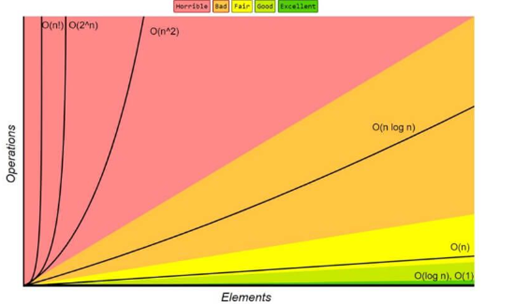

## BIG O NOTATION

<span dir="">A notação BIG O é um método para descrever a eficiência e a complexidade de um determinado algoritmo ou compará-lo com outros pelo número de operações realizadas</span>. Alguns exemplos das principais notações:

<span dir="">1°- Constantes: independente da quantidade de valores de entrada passados, a performance do tempo de resposta dela se manterá a mesma. O tipo de notação dessa função é a O(1).</span>

<span dir="">2°- Linear: caracterizado por realizar uma interação com cada valor passado na entrada, assim a quantidade de operações realizadas será correspondente ao número de valores informados. O tipo de notação dessa função é a O(n).</span>

<span dir="">3°- Exponencial: caracterizado pelo aumento exponencial do número de interações e do tempo de execução dos elementos dentro do algoritmo. São ineficientes e com baixa performance caso estejamos lidando com um grande número de entrada de dados.</span> <span dir="">O tipo de notação dessa função é a O(n²).</span>

<span dir="">4° - Logarítmicos: caracterizado por reduzir pela metade o número de interações e do tempo de execução, como no caso de uma busca binária. O tipo de notação dessa função é a O(log n).</span>

<span dir="">Gráfico de complexidade de notações Big-O:</span>

## Importância para diferentes estruturas de dados

<span dir="">A importância das notações dadas em diferentes estruturas de dados é simples de entender, pois cada uma apresenta uma diferente notação BIG O, ou seja, uma estrutura de dados se difere de outra na eficiência, velocidade e tempo de execução dos algoritmos.</span>

## Prática

### O(1)

```
estagiario = ['Victor', 'João', 'Gabriel', 
	   'Marcos', 'Kauan', 'Kassio'];

def mostra_estagiarios(estagiario):
  print(estagiario[0]) # O(1)
  print(estagiario[1]) # O(1)

mostra_estagiarios(estagiario)
```

### O(n)

```
import time

lista_itens = ['cafés'] * 100000

def mostra_cafe(itens):
  start = time.time()

  for item in itens:
    if(item == 'café'):
      print('Café encontrado!')

  finish = time.time()
  print(f'A operação levou {finish - start} ms');

mostra_cafe(lista_itens);
```

### O(n²)

```
estagiario = ['Victor', 'João', 'Gabriel', 
	   'Marcos', 'Kauan', 'Kassio'];

def mostrar_pares(estagiario):
  for item_a in estagiario:
    for item_b in estagiario:
      print(item_a + ' - ' + item_b)

mostrar_pares(estagiario)
```

### O(log n)

```
numeros = [1, 2, 3, 4, 5, 6 , 7, 8, 9, 10]

def busca_binaria(lista, item):
  first = 0
  last = len(lista)-1
  found = False

  while first <= last and not found:

    meio = (first + last)//2
    
    if lista[meio] == item:
      found = True
    else:
      if item < lista[meio]:
        last = meio - 1
      else:
        first = meio + 1
    print(lista)
    return found

print(busca_binaria(numeros, 5))
```