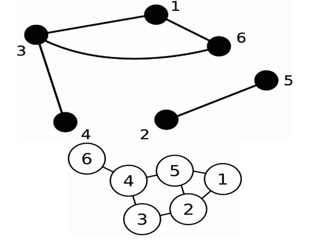
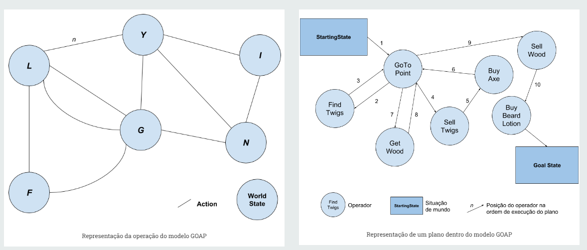

# Grafos

Simplificadamente, um grafo é uma coleção de vértices (V) e uma coleção de arcos (E) constituídos por pares de vértices. Em uma analogia simples, os vértices seriam como ‘locais’, com o conjunto de vértices sendo um conjunto de todos os possíveis locais. Os arcos (ou arestas) representam o caminho entre estes locais. Utilizar grafos é de grande utilidade na representação de problemas da vida real. Alguns exemplos:

1. Mapas de rotas / redes de estrada;

2. Diagramas de pré-requisitos;

3. Relações de amizade no ORKUT;

4. Goal Oriented Action Planning (GOAP);

5. Circuitos elétricos;

6. e milhares de outros.

A representação gráfica é normalmente da seguinte forma:

Vértices são pontos ou círculos; arcos são linhas entre eles.

_V = {1, 2, 3, 4, 5, 6}_ e _E = {(1,3), (1,6), (2,5), (3,4), (3,6)}_.

O grafo adapta-se as nossas necessidades, assim, existindo vários tipos diferentes deles, e junto disso, alguns termos comumente usados para descreve-los. Alguns exemplos:

**Vértice isolado**

Um vértice é considerado isolado se não possuir nenhuma ligação a outro vértice.

**Laço (ou loop/self-loop)**

Um arco é um laço se em ambas as extremidades estiver o mesmo vértice.

**Grafo simples**

Um grafo é simples se não contiver laços nem arcos repetidos em _E_.

**Vértices adjacentes**

Dois vértices (_u_ e _v_) são adjacentes se existir um arco que possui uma extremidade em _u_ e outra em _v_. Os vizinhos de um vértice são todos os vértices adjacentes a ele.

**Grafo pesado (ou grafo de arcos pesados)**

A cada aresta está associado um valor. Pode ser uma distância, um custo, seja o que for.

**Grafo direcionado**

Cada arco tem um nó de origem e um nó de chegada. O exemplo típico é o das redes de estradas, uma vez que existem estradas só com um sentido seria o caos se um GPS não soubesse distingui-las.

**Grau de um vértice (ou valência)**

O grau de um vértice é o número de arcos que lhe são incidentes. Um arco _(u,v)_ é incidente tanto no vértice _u_ como no vértice _v_. Pode-se distinguir grau de entrada e grau de saída em grafos direcionados.

Existem diversas formas de representa-las e armazena-las, e duas das principais são a **Matriz de adjacência** e **Lista de adjacência**.

## Métodos de pesquisas no Grafo (BFS e DFS)

**BFS** ou **Breadth First Search** é uma técnica baseada para armazenar em fila os vértices visitados, assim encontrando o caminho mais curto no grafo. Um vértice é selecionado no momento em que é visitado e marcado, então seus adjacentes são visitados e armazenados na fila sequencialmente.

**DFS** ou **Depth First Search** é uma técnica baseada para armazenar em pilha (stack) os vértices visitados, onde o vértice mais profundo do grafo é selecionado, visitado e marcado para depois visitar seus adjacentes.

## Goal Oriented Action Planning (GOAP)

É uma arquitetura de planejamento projetada com foco no controle de comportamento de personagens autônomos em jogos, ou seja, é um sistema de IA que dará facilmente aos seus agentes opções e ferramentas para tomar decisões inteligentes. Essencialmente, esse modelo trabalha com uma abstração de grafos, sendo utilizado como um meio de construção de uma sequência de ações que satisfaz um dado objetivo através do Algoritmo **Pathfinding A\***.

