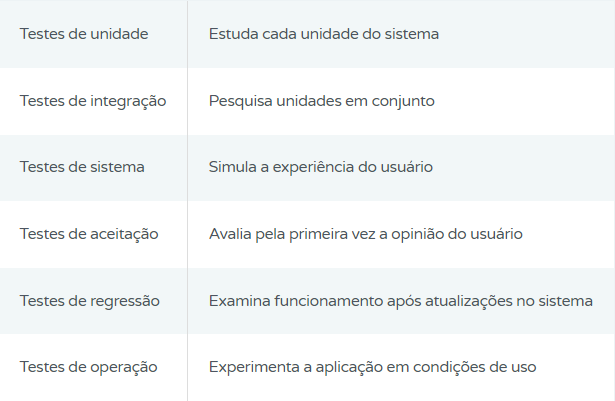

**O que é teste de software?**

Teste de software é um controle de qualidade que pode envolver etapas desde a escolha das condições em que a aplicação vai ser colocada à prova até a simulação de uso real dela e o desenvolvimento de relatórios sobre os resultados obtidos. 

o propósito é verificar se o produto corresponde às funcionalidades esperadas no desenvolvimento e às necessidades dos usuários.

Habitualmente o teste de software é uma das últimas etapas antes que seja disponibilizado ao mercado e deve ser feito por testadores de software, também conhecidos como homologadores, analistas e técnicos de testes. 

Eles vão entender o projeto, sinalizar quais testes devem ser executados, realizar essas ações e apontar eventuais problemas encontrados.

**Tipos de testes de software**

Os testes podem variar de acordo com o objetivo em mente, como aspectos internos ou externos da aplicação. 

No entanto, os testes de software na prática são realizados para garantir que o usuário do produto poderá ter segurança em utilizar o sistema mesmo em situações de grande estresse para o software.

No quadro a seguir você pode conferir os tipos principais tipos. Mais abaixo no texto traremos mais informações sobre cada um deles.

**Qual a importância dos testes de software?**

Esse é um estudo importante em aplicações de diferentes portes. 

Ajuda que o seu time encontre pequenos erros que atrapalham a emissão de documentos fiscais e bugs que levem à perda de desenvolvimentos avançados.

Qualidade é um conceito subjetivo. De fato, mesmo no mundo do software, qualidade está relacionada às pessoas, sejam elas usuários, stakeholders, testadores, ou desenvolvedores. E se está relacionado às pessoas, sempre teremos margem para ambiguidades, conceitos relativos, aspectos culturais e opiniões divergentes. Então, com toda essa subjetividade, como saber que seu software atende aos padrões de qualidade esperados?

Basicamente, o teste de software visa garantir a qualidade, minimizando as incertezas e sistematizando os critérios de aceitação. Ele ajuda a validar se: as expectativas de todas as pessoas envolvidas estão sendo atendidas (e estão alinhadas); o software apresenta um bom funcionamento (parte disso está relacionada às expectativas implícitas – aquilo que é inerente ao produto). Além disso, o teste também possibilita realizar verificações complexas que um ser humano não conseguiria executar (pelo menos, não facilmente).

*Por isso, **estude, explore e questione seus testes** assim como você faz com seu sistema. Isso levará você a aprimorar o entendimento dos requisitos e a forma escolhida para atendê-los. Acreditamos que um dos mais importantes benefícios do teste de software é fazer você pensar diferente, suscitando perguntas que você não teria feito em outros momentos. E isso enriquece o seu projeto.

**O que precisa ser testado?**

A norma ISO 9126, que trata da qualidade de produtos de software, designa 6 atributos que devem ser avaliados. E todos eles são subdivididos, com qualidades inerentes. 

A única característica que se repete sempre é a necessidade de conformidade da aplicação a legislações e padrões vigentes.

**Funcionalidade**
É importante avaliar se a aplicação faz, de fato, o que ela é pensada para executar. E isso deve ser avaliado tanto em relação ao que o usuário explicitamente precisa quanto ao que ele necessita, mesmo que não demonstre objetivamente.

**Confiabilidade**
O sistema consegue manter o padrão de desempenho ideal quando é utilizado dentro das funções previstas? É essa pergunta que deve ser respondida neste quesito do teste de software.

**Usabilidade**
A avaliação da usabilidade pesquisa se o usuário consegue entender e fazer uso da aplicação de um jeito simples.

**Eficiência**
A análise da eficiência do sistema engloba testes sobre o tempo de processamento ou resposta da aplicação.

Outros quesitos são os recursos da máquina que o produto consome e a atenção ao atendimento a regulamentações e normas de eficiência. 

**Manutenibilidade**
Nesse caso, é preciso pesquisar a facilidade com a qual o software pode passar por mudanças, se é simples identificar e corrigir problemas que apareçam após essas alterações e como ele se comporta em testes após ser atualizado.

**Portabilidade**
A capacidade do sistema de ser transferido para ambientes diferentes daquele para o qual ele foi planejado inicialmente deve ser colocada à prova. 

O mesmo vale para a quantidade de alterações que ele precisa para se adaptar a esses novos espaços e a facilidade em conviver com outras aplicações. 

Principais Técnicas Usadas nos Testes de Software
Muitas técnicas podem ser utilizadas para identificar falhas em aplicações. A escolha de cada metodologia de teste de software depende das falhas que estão sendo estudadas. Algumas principais delas são:

**Caixa-Branca**
A técnica da caixa-branca serve para testar códigos-fonte a fim de avaliar fluxo de dados, caminhos lógicos e ciclos, entre outros aspectos internos do software. 

É também chamado de teste estrutural ou orientado à lógica.

**Caixa-Preta**

A técnica funcional, como a caixa-preta também é conhecida, é mais usada para avaliar as funções externas que vão ser realizadas pelo sistema. 

É um estudo que mostra se, ao colocar determinados dados na aplicação, foram obtidos as respostas esperadas.

**Caixa-Cinza**

É a união das duas técnicas de teste de software descritas anteriormente. Daí o nome. 

Essa técnica vai avaliar as funções externas do sistema ao mesmo tempo em que testa a parte lógica, interna. 

**Regressão**

A técnica de regressão representa a realização de testes em cada nova versão de um software a fim de evitar que problemas já resolvidos voltem a ser um obstáculo. 

**Testes não Funcionais**
Um teste de software não funcional serve para avaliar a operação da aplicação em casos inesperados.

Um exemplo é o teste de recuperação para verificar se o software volta a responder como antes após passar por uma falha. 

**Detalhamento dos Tipos de Testes de Software**

**Testes de Unidade**

O teste de software de unidade vai investigar cada unidade ou pequenos trechos da aplicação, como partes do código. 

Com ele, é possível descobrir falhas mínimas, ainda que o software como um todo pareça funcionar corretamente.  

**Testes de Integração**

São eles que vão afirmar que as diversas unidades da aplicação funcionam em conjunto. 

Se uma parte da aplicação não consegue conversar com outra, os testes de integração vão revelar.

**Testes de Sistema**

São os testes realizados simulando as condições que os usuários finais vão vivenciar na prática. 

**Testes de Aceitação**

Essa é uma etapa em que a avaliação do usuário é colocada à prova. 

Por isso costuma ser feita com pequenos grupos que podem incluir o comprador ou outras pessoas. 

É um teste de software em que, por exemplo, pode ser constatado que um ícone é muito pequeno e atrapalha o uso da aplicação.

**Testes de Regressão**

Quando algo é mudado no sistema por conta de uma atualização, os mesmos testes devem ser realizados novamente.

Tudo para evitar que problemas já corrigidos voltem a surgir. 

E essas atividades devem ser adaptadas para as novidades implementadas.

**Testes de Operação**
São aqueles que certificam que o software pode funcionar por muito tempo sem apresentar falhas.

**Fases do Desenvolvimento do Software**

**Alpha**

A etapa de testes Alpha é aquela feita após o término do desenvolvimento do seus sistemas, mas antes da entrega aos clientes. 

Os membros do seu time que tiverem acesso são observados pelo desenvolvedor e estimulados a dar feedbacks sobre o produto.

**Beta**

Já no caso dos testes Beta, o desenvolvedor não tem controle sobre os usuários. E um número maior deles é convidado a participar. 

Com base nas informações que essas pessoas cederem, melhorias serão feitas para que os clientes possam obter todas as vantagens do uso da aplicação no cotidiano. 

**Gama**

É um teste de software feito quando os seus sistemas não tiveram acesso ideal as avaliações anteriormente descritas. 

Nesse caso, o software é lançado ao mercado com eventuais erros e os ajustes acontecerão durante o uso.

**O Processo dos Testes (Ciclo de Vida)**

Planejamento, Preparação, Especificação, Execução e Entrega, nesta ordem, compõem o ciclo de vida dos testes. 

Confira:

**Planejamento:** essa é a fase de desenvolvimento da estratégia do teste e do plano de teste.
**Preparação:** nesta etapa, vai ser assegurado que o ambiente para o testes é o ideal, para que tudo seja executado como planejado.
Envolve a preparação de equipe e equipamentos, por exemplo.  
**Especificação:** é o momento de elaboração e revisão dos casos de teste e dos roteiros de teste.
**Execução:** é a fase do processo de teste de software em que as ações são executadas e há o registro dos resultados.
**Entrega:** consiste na finalização do processo e arquivamento da documentação obtida.  

**Conclusão**

O teste de software na prática é essencial para que qualquer solução chegue ao usuários final atendendo a todos os requisitos mapeados e as expectativas do público alvo

Investir nessa prevenção é muito importante.

E não é à toa que metodologias de teste de software foram criadas assim como diferentes tipos de ferramentas de teste de software estão disponíveis no mercado.

Aproveite e avalie o seu processo de teste de software. 

Veja se de fato ele está sendo suficiente para evitar falhas, poupar seu time de suporte e manutenção e manter seu cliente satisfeito.

